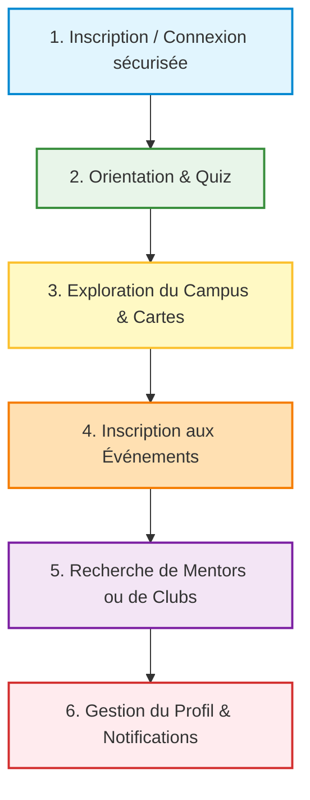

# 🎓 Présentation Grand Public : CampusGuide (UNH)
*Comment expliquer son projet de A à Z à des non-informaticiens sans jargon technique.*

> [!TIP]
> **Conseil de présentation :** Face à un public non technique, évitez les noms de technologies bruts au début. Mettez l'accent sur **les problèmes réels** des étudiants (le stress de trouver une salle, l'isolement, le manque d'informations) et sur **les solutions simples** qu'apporte votre application. Utilisez des images ou faites des démonstrations en direct si possible !

---

## 🗺️ Table des matières
1. [L'Histoire et le Problème (L'Introduction)](#1-lhistoire-et-le-problème-lintroduction)
2. [Qu'est-ce que CampusGuide ? (Le Pitch)](#2-quest-ce-que-campusguide-le-pitch)
3. [Le Parcours de l'Étudiant de A à Z](#3-le-parcours-de-létudiant-de-a-à-z)
4. [La Métaphore du Restaurant : Comment ça marche "derrière le rideau" ?](#4-la-métaphore-du-restaurant--comment-ça-marche-derrière-le-rideau)
5. [La Tour de Contrôle (L'Espace Admin)](#5-la-tour-de-contrôle-lespace-admin)
6. [La Sécurité expliquée simplement](#6-la-sécurité-expliquée-simplement)
7. [Guide Diapo par Diapo (Votre Script de Présentation)](#7-guide-diapo-par-diapo-votre-script-de-présentation)

---

## 1. L'Histoire et le Problème (L'Introduction)

### La situation de départ
Imaginez un nouvel étudiant qui arrive à l'**Université Nouveaux Horizons (UNH)**. C'est son premier jour. Il est stressé, il a peur d'arriver en retard. 
* Il cherche la salle du cours de programmation ou le centre de simulation médicale.
* Il doit regarder des tableaux d'affichage papier ou demander son chemin à dix personnes différentes.
* Il souhaite rejoindre un club universitaire ou trouver un parrain (mentor) parmi les anciens, mais il ne sait pas à qui s'adresser.
* Il rate un événement important car l'information s'est perdue dans un groupe WhatsApp ou un e-mail non lu.

### Le constat
L'information existe, mais elle est **éparpillée** et difficile d'accès. 

---

## 2. Qu'est-ce que CampusGuide ? (Le Pitch)

**CampusGuide** est le compagnon de poche numérique officiel de l'étudiant à l'UNH. 

C'est une plateforme web unique qui regroupe, organise et simplifie toute la vie sur le campus en un clic. 
* **Plus besoin de chercher :** Tout est centralisé.
* **Plus de stress :** Les cartes et trajets sont interactifs et illustrés par de vraies photos.
* **Plus de solitude :** L'entraide (le mentorat) et la vie associative (les clubs) sont à portée de main.

---

## 3. Le Parcours de l'Étudiant de A à Z

Voici comment un étudiant utilise l'application au quotidien :



### Étape A : L'accueil chaleureux
L'étudiant arrive sur une page d'accueil moderne. Il se connecte en toute sécurité avec son e-mail universitaire. L'application le reconnaît, charge ses informations personnalisées et affiche sa photo de profil.

### Étape B : Trouver sa voie (L'Orientation)
Grâce à un **Quiz interactif**, l'étudiant répond à quelques questions simples sur ses centres d'intérêt. L'application analyse ses réponses et lui conseille les filières les plus adaptées à ses passions.

### Étape C : Se repérer sur le campus (La Carte Interactive)
C'est le joyau de l'application. L'étudiant sélectionne un bâtiment (UNH 1, UNH 2, UNH 3) et cherche une salle (par exemple, le centre de simulation médicale). 
* **Ce qu'il voit :** Une fiche complète avec une **vraie photo** de la salle pour savoir à quoi elle ressemble avant d'y entrer.
* **Le petit plus :** L'itinéraire exact étape par étape depuis l'entrée principale du bâtiment. Plus aucun risque de se perdre !

### Étape D : Ne plus rien rater (Le Calendrier Académique)
L'étudiant consulte le calendrier en temps réel. Il y voit les examens, les vacances, mais aussi les événements de la vie étudiante. En un clic, il peut **s'inscrire à un événement** pour réserver sa place.

### Étape E : S'intégrer et s'entraider (Mentors & Clubs)
* **Les Mentors :** L'étudiant peut rechercher un mentor (un étudiant plus âgé de sa filière) pour l'aider dans ses devoirs ou lui donner des conseils. S'il se sent prêt, il peut lui-même postuler pour devenir mentor !
* **Les Clubs :** Il découvre tous les clubs de l'université (sportifs, culturels, scientifiques) et peut les rejoindre instantanément en cliquant sur un bouton.

---

## 4. La Métaphore du Restaurant : Comment ça marche "derrière le rideau" ?

Pour expliquer le fonctionnement technique de CampusGuide à des non-informaticiens, utilisez la **métaphore d'un grand restaurant** :

```
┌────────────────────────────────────────────────────────┐
│                   LE RESTAURANT CAMPUSGUIDE            │
├────────────────────────────────────────────────────────┤
│  1. LA VITRINE & LA SALLE (Le Frontend - React/Tailwind)│
│     - Ce que le client voit et touche.                 │
│     - Les jolis menus, les tables, les animations.     │
│                                                        │
│  2. LE SERVEUR / LE CHEF (Le Backend - Node/Express)  │
│     - Reçoit la commande, va en cuisine, prépare.     │
│     - Fait le lien entre la salle et la réserve.       │
│                                                        │
│  3. LE GARDE-MANGER (La Base de données - MySQL)       │
│     - Où les ingrédients sont stockés et étiquetés.    │
│     - Salles, événements, profils, mentors.            │
└────────────────────────────────────────────────────────┘
```

### 1. Le Frontend (React.js, TailwindCSS) : *La Salle du Restaurant*
* **C'est quoi ?** C'est la partie visuelle de l'application. Tout ce que l'étudiant voit sur son écran (les boutons bleus, les photos de salles, les animations fluides, le quiz d'orientation).
* **Pourquoi c'est moderne ?** Grâce à **React.js**, la page ne se recharge pas entièrement à chaque fois qu'on clique sur un bouton. Tout est instantané et fluide, comme une application mobile native. **TailwindCSS** assure que l'application est magnifique, que ce soit sur un grand écran d'ordinateur ou sur l'écran d'un smartphone.

### 2. Le Backend (Node.js, Express.js) : *Le Chef de Cuisine*
* **C'est quoi ?** C'est le cerveau invisible. Il écoute les demandes de l'utilisateur. 
* **Comment ça marche ?** Quand l'étudiant clique sur "S'inscrire à un événement", le Frontend envoie un ticket invisible ("le bon de commande") au Backend. Le Backend vérifie si l'étudiant a le droit de le faire, prépare l'information et la transmet à la base de données.

### 3. La Base de Données (MySQL) : *Le Garde-Manger*
* **C'est quoi ?** C'est la mémoire du projet. C'est un immense tableau organisé où chaque information a sa place exacte.
* **Qu'est-ce qu'on y stocke ?** La liste des étudiants avec leurs mots de passe, les coordonnées GPS et photos des salles, l'agenda des examens, les candidatures de mentors, etc. Rien ne se perd, même si le serveur s'éteint.

---

## 5. La Tour de Contrôle (L'Espace Admin)

Une université a besoin de contrôler ce qui se passe. CampusGuide intègre un **Tableau de bord administrateur** réservé au personnel de l'UNH.

Depuis cet espace sécurisé, l'administrateur peut :
1. **Gérer les comptes :** Corriger une erreur de frappe sur le nom d'un étudiant, ou désactiver un compte si nécessaire.
2. **Superviser l'entraide :** Valider ou refuser les candidatures des étudiants qui souhaitent devenir mentors (pour s'assurer de la qualité du soutien).
3. **Animer le campus :** Ajouter de nouveaux événements au calendrier en temps réel ou supprimer ceux qui sont annulés.

---

## 6. La Sécurité expliquée simplement

Pour rassurer votre public sur la protection des données des étudiants, vous pouvez expliquer vos deux outils de sécurité avec des images concrètes :

### A. Bcrypt : *Le Broyeur de documents*
* **Le problème :** On ne doit jamais stocker les mots de passe des étudiants "en clair" (lisibles) dans la base de données. Si quelqu'un piratait le serveur, il verrait tout.
* **La solution (Bcrypt) :** C'est comme un broyeur de papier magique. Quand un étudiant crée son mot de passe `campus123`, Bcrypt le transforme en une bouillie de caractères méconnaissable (`$2b$12$e8Y...`). Il est **impossible** de faire le chemin inverse pour retrouver le mot de passe d'origine. Quand l'étudiant se connecte, l'application compare les "morceaux broyés" pour voir s'ils correspondent.

### B. JWT (JSON Web Token) : *Le Bracelet VIP du festival*
* **Le problème :** Comment le serveur sait-il que vous êtes connecté à chaque fois que vous changez de page, sans vous redemander votre mot de passe à chaque clic ?
* **La solution (JWT) :** Lors de la connexion, le serveur vous remet un "bracelet VIP virtuel" (le jeton sécurisé). Ce bracelet contient votre identité cryptée. À chaque fois que vous demandez à voir une page privée (comme votre profil ou l'administration), vous montrez simplement votre bracelet au serveur. C'est rapide, automatique et inviolable.

---

## 7. Guide Diapo par Diapo (Votre Script de Présentation)

Voici une trame de présentation de **5 à 7 minutes**, prête à l'emploi.

---

### 🎬 Diapositive 1 : Accueil & Titre
* **Visuel suggéré :** Logo de l'UNH, titre élégant "CampusGuide", votre nom.
* **Ce que vous dites :** 
  > "Bonjour à tous. Je m'appelle Bonheur Nzau et je suis ravi de vous présenter aujourd'hui mon projet de fin d'études : **CampusGuide**, une application conçue sur-mesure pour moderniser la vie étudiante au sein de notre université, l'Université Nouveaux Horizons."

---

### 🎬 Diapositive 2 : Le Défi du Nouvel Étudiant
* **Visuel suggéré :** Une photo d'un étudiant perdu ou des panneaux d'affichage surchargés de papiers.
* **Ce que vous dites :**
  > "Nous sommes tous passés par là : arriver sur un grand campus et se sentir perdu. Trouver sa salle de cours dans le bâtiment UNH 2, savoir quand ont lieu les examens, ou essayer de s'inscrire à un club sans savoir à qui écrire. Actuellement, ces informations sont dispersées sur papier, par e-mail ou sur des réseaux sociaux. Mon but était de créer un point d'accès unique."

---

### 🎬 Diapositive 3 : La Solution : CampusGuide
* **Visuel suggéré :** Captures d'écran de l'application (l'accueil chaleureux sur ordinateur et mobile).
* **Ce que vous dites :**
  > "CampusGuide est une plateforme web interactive. En quelques clics, chaque étudiant accède à son profil, à la carte du campus, aux clubs et au calendrier académique. L'application est 'responsive', c'est-à-dire qu'elle s'adapte parfaitement aux téléphones portables pour que les étudiants l'aient toujours sur eux dans la cour ou les couloirs."

---

### 🎬 Diapositive 4 : L'Itinéraire des salles et Photos réelles
* **Visuel suggéré :** Capture d'écran de la page "Campus", montrant une fiche de salle avec sa photo réelle et le trajet textuel.
* **Ce que vous dites :**
  > "Notre fonctionnalité phare est la carte interactive. Au lieu de simples plans en 2D souvent difficiles à lire, chaque salle importante de l'UNH a sa propre fiche d'identité. L'étudiant y trouve une vraie photo de la salle, sa capacité d'accueil et surtout le chemin exact à suivre depuis l'entrée. C'est une aide à l'orientation concrète et visuelle."

---

### 🎬 Diapositive 5 : L'Entraide et la Vie du Campus
* **Visuel suggéré :** Images illustrant la page "Mentors" et la page "Clubs".
* **Ce que vous dites :**
  > "Mais l'université, ce n'est pas que des cours. C'est aussi de la solidarité. CampusGuide propose un espace de mentorat où les étudiants en difficulté peuvent trouver des tuteurs parmi les plus anciens. C'est aussi un annuaire dynamique des clubs étudiants pour s'impliquer dans la vie associative de l'UNH."

---

### 🎬 Diapositive 6 : Sous le capot : Comment ça fonctionne ?
* **Visuel suggéré :** Un schéma simple illustrant le triptyque : l'Écran (Frontend), le Serveur (Backend), et la Mémoire (Base de données).
* **Ce que vous dites :**
  > "Pour les plus curieux, comment fonctionne cette magie ? C'est ce qu'on appelle une application complète, ou 'Full-Stack'. D'un côté, il y a la vitrine de l'application construite avec des outils modernes comme React. De l'autre, il y a le cerveau invisible, le serveur, qui gère la logique de sécurité et distribue les informations stockées fidèlement dans notre base de données MySQL."

---

### 🎬 Diapositive 7 : Une Sécurité de niveau bancaire
* **Visuel suggéré :** Icônes de cadenas et de coffre-fort.
* **Ce que vous dites :**
  > "Nous accordons une importance capitale à la vie privée. Tous les mots de passe des étudiants sont immédiatement cryptés grâce à des algorithmes de pointe appelés Bcrypt. Même en tant que concepteur du site, je suis incapable de lire le mot de passe d'un utilisateur. De plus, chaque connexion génère un badge numérique temporaire et sécurisé pour garantir qu'un étudiant ne puisse jamais accéder aux données d'un autre."

---

### 🎬 Diapositive 8 : Conclusion & Perspectives
* **Visuel suggéré :** Une belle photo finale du campus UNH avec vos remerciements.
* **Ce que vous dites :**
  > "Pour conclure, CampusGuide n'est pas seulement un projet informatique ; c'est un outil vivant pensé pour faciliter le quotidien de chacun à l'UNH. Il montre comment la technologie peut rendre notre campus plus connecté, plus solidaire et plus moderne. Je vous remercie pour votre attention et je suis maintenant ouvert à toutes vos questions !"

---
